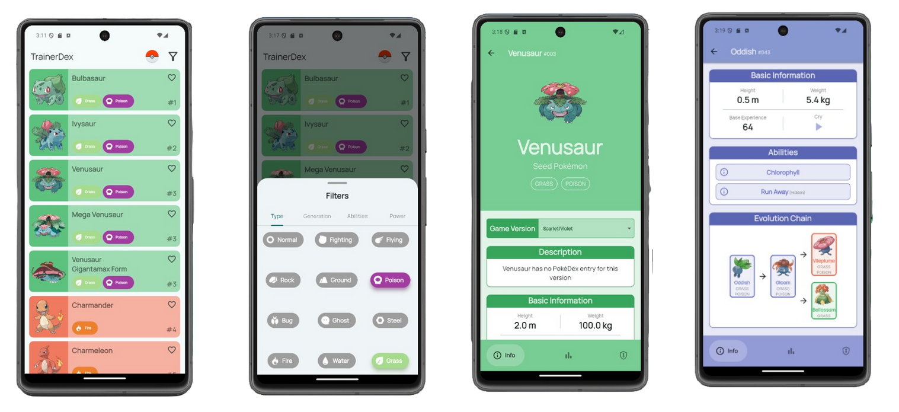

# TrainerDex



# TrainerDex

## Índice

1. [Descripción del proyecto](#descripción-del-proyecto)
2. [Instalación](#instalación)
3. [Tecnologías usadas](#tecnologías-usadas)
4. [Funcionalidades Principales](#funcionalidades-principales)
5. [Uso de la API GraphQL](#uso-de-la-api-graphql)

## Descripción del proyecto

TrainerDex es una aplicación desarrollada con Flutter que permite a los usuarios explorar y obtener información detallada sobre diferentes Pokémon. Utiliza GraphQL para interactuar con la API de PokeAPI, proporcionando datos precisos y actualizados sobre cada Pokémon. La aplicación está diseñada para ser intuitiva y fácil de usar, ofreciendo una experiencia de usuario fluida y atractiva.

## Instalación

Para instalar y ejecutar este proyecto localmente, sigue estos pasos:

1. Clona el repositorio:
    
    ```
    git clone https://github.com/RomAbreu/trainerdex
    ```
    
2. Navega al directorio del proyecto:
    
    ```
    cd trainerdex
    ```
    
3. Instala las dependencias:
    
    ```
    flutter pub get
    ```
    
4. Ejecuta la aplicación:
    
    ```
    flutter run
    ```
    

## Tecnologías usadas

- **Flutter**: Framework para construir aplicaciones nativas multiplataforma.
- **GraphQL**: Lenguaje de consulta para APIs.
- **PokeAPI**: API pública para obtener datos sobre Pokémon.

## Funcionalidades Principales

- Explorar una lista de todos los pokémones existentes.
- Ver detalles específicos de cada Pokémon como su descripción, estadísticas, evoluciones, movimientos, entre otras informaciones.
- Permite aplicar diferentes filtros a la búsqueda de pokémones.

## Uso de la API GraphQL

La aplicación utiliza GraphQL para interactuar con la API de PokeAPI. Se configura de la siguiente manera:

```dart
ValueNotifier<GraphQLClient> initializeClient() {
  final HttpLink httpLink = HttpLink(
    'https://beta.pokeapi.co/graphql/v1beta',
    defaultHeaders: {'content-type': 'application/json', 'accept': '*/*'},
  );

  final ValueNotifier<GraphQLClient> client = ValueNotifier(
    GraphQLClient(
      cache: GraphQLCache(),
      link: httpLink,
    ),
  );

  return client;
}
```

Y su respectiva inicialización en `lib/main.dart`:

```dart
Widget build(BuildContext context) {
  return GraphQLProvider(
    client: initializeClient(),
    child: MaterialApp(
      debugShowCheckedModeBanner: false,
      title: 'TrainerDex',
      theme: AppTheme.getAppTheme(),
      home: const HomeView(),
    ),
  );
}
```

Ejemplo de un query encontrado en `lib/repositories/pokemon_general_repository.dart`:

```dart
static Future<int> countPokemons(GraphQLClient client,
    [List<String>? typeFilter, int? generationFilter]) async {
  const String query = """
    query getTotalPokemons(\$where: pokemon_v2_pokemon_bool_exp) {
      pokemon_v2_pokemon_aggregate(where: \$where) {
        aggregate {
          count
        }
      }
    }
  """;

  final filters = _prepareFilters(typeFilter, generationFilter);

  final QueryResult result = await client.query(
    QueryOptions(document: gql(query), variables: {'where': filters}),
  );
  return result.data?['pokemon_v2_pokemon_aggregate']['aggregate']['count'];
}
```

## Decisiones de diseño

- En este proyecto, se utiliza una arquitectura basada en el patrón View-Model en conjunto con el patrón Repository. Los repositorios se encargan de obtener los datos en formato JSON y convertirlos a modelos.

- Para el manejo de estado, se emplean `StatefulWidgets`, y los objetos que necesitan ser compartidos entre clases se almacenan en archivos terminados en `_view.dart`. Esto permite que las interfaces respondan a los cambios de estado, siendo la paginación un buen ejemplo de este enfoque.

- Se decidió hacer el código modular, dígase que los widgets y constantes compartidas se encuentran en una carpeta de fácil acceso, independiente de otros widgets.